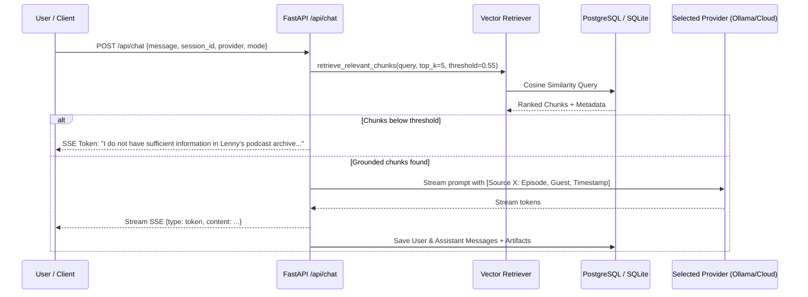

# System Architecture Specification
## The Lenny Growth Assistant

**Version:** 1.0.0  
**Target:** Local Forward-Deployment & Production Cloud  

---

## 1. System Topology Overview

```
                  +--------------------------------------------------+
                  |               React + Vite Frontend              |
                  |  - Chat Pane (Streaming SSE, Citations, Modes)   |
                  |  - Model Selector (Ollama / Cloud / Demo)        |
                  |  - Sandboxed Artifact Viewer (DOMPurify+Iframe)  |
                  +-------------------------+------------------------+
                                            |
                                HTTP / SSE  | /api/sessions, /api/chat, /api/health
                                            v
                  +--------------------------------------------------+
                  |                 FastAPI Backend                  |
                  |  - CORS, Error Handling, Structured JSON Logging |
                  |  - Dynamic LLM Router (Ollama, Claude, OpenAI)   |
                  |  - Ship 30 for 30 Skill Engine                   |
                  |  - Artifact Extraction & Verification Parser     |
                  +------------+-------------------------+-----------+
                               |                         |
                               v                         v
                 +-----------------------+     +--------------------+
                 |    Vector Retriever   |     | Persistence Layer  |
                 | - Hybrid/Cosine RAG   |     | - Sessions         |
                 | - Strict Thresholding |     | - Messages         |
                 | - Source Attribution  |     | - Artifacts        |
                 +-----------+-----------+     +---------+----------+
                             |                           |
                             +-------------+-------------+
                                           |
                                           v
                 +--------------------------------------------------+
                 |            Database (Async SQLAlchemy)           |
                 |  - Primary: PostgreSQL 16 with pgvector          |
                 |  - Zero-Dep Fallback: SQLite + Cosine Vectors    |
                 +--------------------------------------------------+
```

---

## 2. Database Schema

The persistence layer uses SQLAlchemy 2.0 async engine. The relational structure maps sessions, messages, artifacts, and vectorized transcript chunks:

```sql
-- 1. Sessions Table
CREATE TABLE sessions (
    id VARCHAR(36) PRIMARY KEY,
    title VARCHAR(255) NOT NULL,
    created_at TIMESTAMP WITH TIME ZONE DEFAULT CURRENT_TIMESTAMP,
    updated_at TIMESTAMP WITH TIME ZONE DEFAULT CURRENT_TIMESTAMP
);

-- 2. Messages Table
CREATE TABLE messages (
    id VARCHAR(36) PRIMARY KEY,
    session_id VARCHAR(36) REFERENCES sessions(id) ON DELETE CASCADE,
    role VARCHAR(20) NOT NULL, -- 'user', 'assistant', 'system'
    content TEXT NOT NULL,
    sources JSONB DEFAULT '[]', -- Array of citation references
    provider VARCHAR(50),      -- 'ollama', 'claude', 'openai', 'mock'
    mode VARCHAR(50),          -- 'default', 'ship30'
    created_at TIMESTAMP WITH TIME ZONE DEFAULT CURRENT_TIMESTAMP
);

-- 3. Artifacts Table
CREATE TABLE artifacts (
    id VARCHAR(36) PRIMARY KEY,
    message_id VARCHAR(36) REFERENCES messages(id) ON DELETE CASCADE,
    session_id VARCHAR(36) REFERENCES sessions(id) ON DELETE CASCADE,
    artifact_type VARCHAR(20) NOT NULL, -- 'html' or 'markdown'
    title VARCHAR(255) NOT NULL,
    content TEXT NOT NULL,
    created_at TIMESTAMP WITH TIME ZONE DEFAULT CURRENT_TIMESTAMP
);

-- 4. Transcript Chunks Table (Vector Store)
CREATE TABLE transcript_chunks (
    id VARCHAR(36) PRIMARY KEY,
    episode_slug VARCHAR(150) NOT NULL,
    episode_title VARCHAR(255) NOT NULL,
    guest_name VARCHAR(150) NOT NULL,
    publish_date VARCHAR(30),
    youtube_url TEXT,
    timestamp_ref VARCHAR(20),
    chunk_index INTEGER NOT NULL,
    chunk_text TEXT NOT NULL,
    embedding VECTOR(384) -- pgvector 384-dim (or stored as JSON array in SQLite fallback)
);

CREATE INDEX idx_transcript_chunks_episode ON transcript_chunks(episode_slug);
-- In PostgreSQL: CREATE INDEX idx_chunks_embedding ON transcript_chunks USING hnsw (embedding vector_cosine_ops);
```

---

## 3. Dynamic LLM Provider Abstraction

The backend decouples prompt handling and model execution behind a clean interface:

```python
class BaseLLMProvider(ABC):
    @abstractmethod
    async def generate_response(
        self,
        messages: List[Dict[str, str]],
        system_prompt: str,
        temperature: float = 0.3
    ) -> AsyncGenerator[str, None]:
        """Stream response tokens asynchronously."""
        pass

    @abstractmethod
    async def check_health(self) -> Dict[str, Any]:
        """Return connectivity and model availability status."""
        pass
```

### Provider Implementation Strategy
1. **OllamaProvider:**
   - Connects to `http://localhost:11434/api/chat`.
   - Streams JSON chunks with `httpx.AsyncClient(timeout=60.0)`.
   - Supports local models: `llama3.2:3b`, `llama3.1:8b`, `mistral:7b`.
2. **CloudProvider (Anthropic / OpenAI):**
   - Supports Anthropic Claude 3.5 Sonnet and OpenAI GPT-4o.
   - Reads `ANTHROPIC_API_KEY` or `OPENAI_API_KEY` from environment.
3. **MockProvider:**
   - Deterministic, high-fidelity mock engine returning fully formatted grounded responses and artifacts.
   - Used for unit tests, offline automated QA, and immediate evaluator walkthroughs when local LLMs or API keys are unavailable.

---

## 4. Ingestion & Retrieval (RAG) Architecture

### 4.1 Ingestion Pipeline (`backend/scripts/ingest.py`)
1. **Directory Traversal:** Scans `episodes/{guest-name}/transcript.md`.
2. **Frontmatter Extraction:** Parses YAML block to extract `guest`, `title`, `youtube_url`, `publish_date`, `keywords`.
3. **Dialogue Segmentation:** Splits transcript text along speaker turn markers `Name (HH:MM:SS):`.
4. **Windowed Chunking:** Groups dialogue turns into $500\text{--}800$ token windows with $100$-token overlap, maintaining speaker tags and timestamp references in chunk headers.
5. **Vector Embedding:** Generates high-efficiency normalized 384-dimensional embeddings.
6. **Indexing:** Upserts chunks into PostgreSQL `transcript_chunks` with HNSW cosine index or SQLite vector table.

### 4.2 Retrieval & Grounding Workflow


---

## 5. Security Architecture & Untrusted Artifact Rendering

### Threat Model
The assistant can generate arbitrary HTML and JavaScript at the user's request (e.g., interactive calculators, widgets). Rendering arbitrary HTML directly into the web application exposes the user to:
- **Cross-Site Scripting (XSS):** Access to parent session tokens, cookies, or localStorage.
- **Clickjacking / DOM Hijacking:** Manipulating the chat application interface.
- **External Data Exfiltration:** Malicious fetch calls to external malicious servers.

### Two-Tier Isolation Defense
1. **Tier 1: DOMPurify Sanitization:**
   Before mounting into the viewer, the markup is processed through `DOMPurify` to eliminate known dangerous exploit vectors while permitting safe HTML5, inline `<style>`, and standard interactive UI structures.
2. **Tier 2: Hardened Sandboxed Iframe:**
   Rendered in an `<iframe>` configured with:
   ```html
   <iframe
     title="Artifact Preview"
     srcdoc="..."
     sandbox="allow-scripts"
     referrerpolicy="no-referrer"
   />
   ```
   **CRITICAL:** `allow-same-origin` is **intentionally omitted**. This treats the iframe as a unique, opaque origin:
   - It cannot access `window.parent`, `localStorage`, `sessionStorage`, or cookies of the host application.
   - It cannot make authenticated same-origin network requests.
   - Scripts can run locally inside the iframe sandbox for UI interactivity (sliders, buttons, calculators), but cannot escape into the parent application.

---

## 6. Observability & Resilience

- **Structured Logging:** Every request logs `session_id`, `provider`, `mode`, `retrieval_chunks_count`, `latency_ms`, and `status_code`.
- **Health Probes (`/api/health`):**
  - Database connectivity (latency check).
  - Ollama connectivity (model list probe).
  - Vector index readiness (total chunks indexed).
- **Graceful Error Envelopes:**
  ```json
  {
    "error": {
      "code": "PROVIDER_UNAVAILABLE",
      "message": "Ollama service at http://localhost:11434 is unreachable. Please start Ollama or switch to Cloud/Demo mode in the header.",
      "details": {}
    }
  }
  ```
